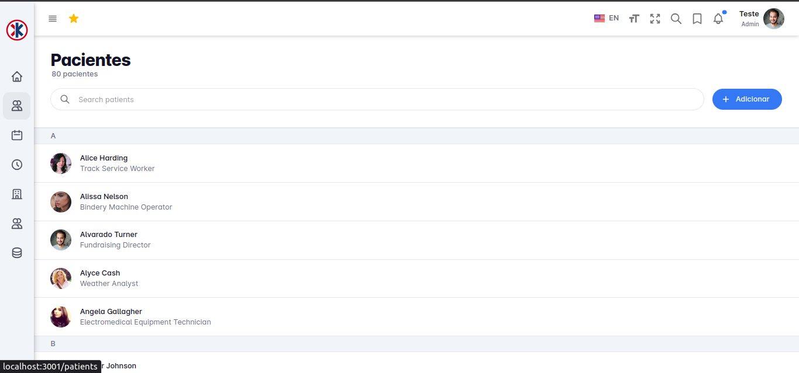

# Introdução

O presente documento tem como objetivo apresentar as entregas contínuas realizadas pelo grupo em prol da reconstrução e da incorporação de novas funcionalidades nas plataformas da Klinika. Neste documento, iremos destacar as contribuições significativas que nossa equipe tem feito para aprimorar e expandir as capacidades dos sistemas da Klinika.

# Funcionalidades

## Relatório de problemas da plataforma

Com o intuito de obter uma visão abrangente da situação atual da plataforma Klinika, foi requisitada a elaboração de um relatório sobre os problemas identificados na mesma.

<iframe src="https://docs.google.com/document/d/1DQ9I0LlKV0hWC0tBxVHwx60KABT_GrfjC5JCrcMsNbM" width="800" height="600" frameborder="0" allowfullscreen></iframe>

## Modelo transcrição áudio

Com o intuito de apresentar uma solução de inteligencia artificial para a klinika o grupo estudou os modelos ofertados pela OpenAI e construiu um modelo base de transcrição de áudio em resposta a perguntas do usuário. Para saber mais sobre o modelo [clique aqui](../transcribeAudio.md).

## Criação de API para a IA no frontend

Após a aprovação da solução proposta pelo grupo, foi requisitada a criação de uma API que incorporasse a inteligência artificial, a ser utilizada pelo frontend da Klinika.

## Listagem de pacientes

Atualmente, a Klinika está em processo de manutenção em seu servidor, o que impactou a exibição dos pacientes cadastrados no banco de dados na tela de listagem. Devido a essa situação, estamos temporariamente utilizando uma API mockada para a construção da interface de listagem.

## Inteligência Artificial da Klinika

Agora que nossa API está operacional, estamos dando mais um passo em direção à otimização dos serviços da Klinika. Para isso, foi requisitada a implementação de uma interface para o consumo dessa API.

## Gerenciamento de Administradores

Módulo do sistema de administração encarregado de gerenciar os administradores da Klinika, incluindo funcionalidades de listagem, cadastro, edição e exclusão.

## Gerenciamento de CIDs

Módulo do sistema de administração encarregado de gerenciar os CIDs, ou seja, a classificação de doenças e problemas relacionados à saúde, incluindo funcionalidades de listagem, cadastro, edição e exclusão.

## Gerenciamento de Exames Físicos

Módulo do sistema de administração encarregado de gerenciar os exames fisicos, ou seja, a classificação de exames, incluindo funcionalidades de listagem, cadastro, edição e exclusão.

## Gerenciamento de Procedimentos Médicos 

Módulo do sistema de administração encarregado de gerenciar os procedimentos medicos, incluindo funcionalidades de listagem, cadastro, edição e exclusão.

## Gerenciamento de Vacinas 

Módulo do sistema de administração encarregado de gerenciar as vacias, incluindo funcionalidades de listagem, cadastro, edição e exclusão.

## Gerenciamento de Medicamentos

Módulo do sistema de administração encarregado de gerenciar os medicamentos, incluindo funcionalidades de listagem, cadastro, edição e exclusão.

## Cadastro de Pacientes
Módulo do sistema onde é possivel realizar o cadastro de novos pacientes.

## Edição do Cadastro de Pacientes
Módulo do sistema onde é possivel realizar a edição de pacientes já cadastrados.

## Protótipo para a página de agendamentos
Protótipo feito no figma para a página de agendamentos de consultas feito no figma de acordo com 
a reunião do dia 25/08/2023.

