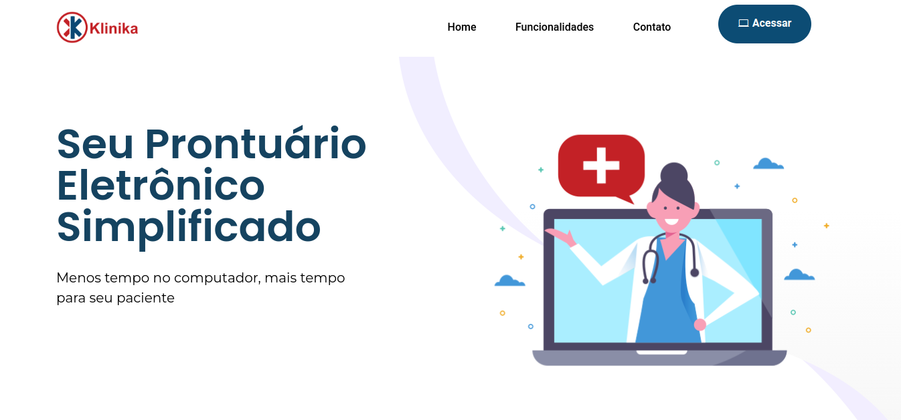

# Página Inicial

## Introdução

Este repositório do GitHub Pages foi criado com o propósito de detalhar e registrar todo o trabalho em andamento no nosso projeto. Aqui, vamos compartilhar regularmente o progresso alcançado pelos membros da equipe, suas experiências e aprendizados, bem como a evolução contínua do projeto. A documentação tem como principal objetivo auxiliar no acompanhamento da equipe, mas também visa compartilhar o conhecimento adquirido com qualquer pessoa que acesse esta página.

Na página inicial, você encontrará um breve resumo sobre o que é o projeto Klinika e uma lista dos colaboradores que estão formando a equipe.

## Sobre a Klinika

A Klinika está atualmente empenhada no desenvolvimento de um prontuário eletrônico com o objetivo de otimizar significativamente o processo de atendimento médico. Reconhecemos que já existem diversas opções de prontuários eletrônicos no mercado, mas nossa visão é oferecer uma solução abrangente e inovadora que aborde uma das principais preocupações dos médicos: o tempo e detalhamento necessários para preencher prontuários.

Nossa proposta é criar um prontuário eletrônico que reduza ao mínimo possível o esforço do médico durante o processo de preenchimento. Queremos simplificar a criação do prontuário, minimizando a quantidade de cliques necessários. Isso permitirá que os médicos realizem atendimentos de forma mais ágil e precisa, dedicando mais tempo aos pacientes.

A plataforma Klinka Web já estava em funcionamento. Atendendo ao pedido do cliente, estamos realizando uma migração tecnológica, passando de Angular para React. O foco principal da equipe é efetuar essa migração, corrigindo eventuais problemas existentes na plataforma anterior e, ao mesmo tempo, incorporando novas funcionalidades conforme as necessidades surgem.

Além do desenvolvimento das telas utilizando React, também implementamos uma solução de inteligência artificial para [transcrição de áudio](./transcribeAudio.md) que também se encontra na documentação.

## Colaboradores

Os integrantes deste projeto são estudantes da Universidade de Brasília, especificamente do campus FGA, todos matriculados no curso de Engenharia de Software e atualmente se encontram no 6º e 7º semestre. A seguir, você encontrará uma lista dos colaboradores, acompanhados de suas funções e respectivas contas no GitHub.

<a href="https://github.com/analuizargds" target="_blank">
    <figure>
      
      <figcaption style="font-weight: bold; color: #000000; font-size: 15px">
        Ana Luiza  
        (Product Manager)
      </figcaption>
    </figure>
</a>

<a href="https://github.com/PedroHenrique2077" target="_blank">
    <figure>
      
      <figcaption style="font-weight: bold; color: #000000; font-size: 15px">
        Pedro Henrique  
        (Líder Técnico)
      </figcaption>
    </figure>
</a>

<a href="https://github.com/Izarias" target="_blank">
    <figure>
      
      <figcaption style="font-weight: bold; color: #000000; font-size: 15px">
        Pedro Augusto  
        (Machine Learning)
      </figcaption>
    </figure>
</a>

<a href="https://github.com/SamuelGSouza" target="_blank">
    <figure>
      
      <figcaption style="font-weight: bold; color: #000000; font-size: 14px">
        Samuel Gomes  
        (Community Manager)
      </figcaption>
    </figure>
</a>

<a href="https://github.com/verabelucia" target="_blank">
    <figure>
      
      <figcaption style="font-weight: bold; color: #000000; font-size: 15px">
        Vera Lucia  
        (Scrum Master)
      </figcaption>
    </figure>
  </a>

